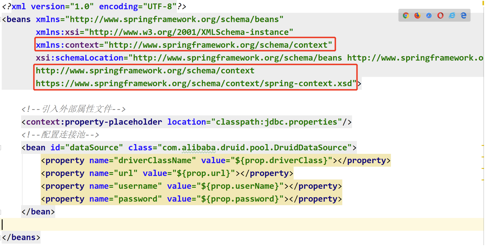
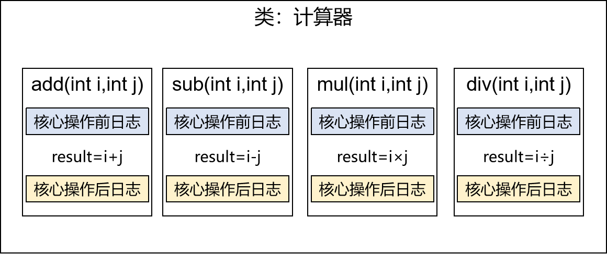
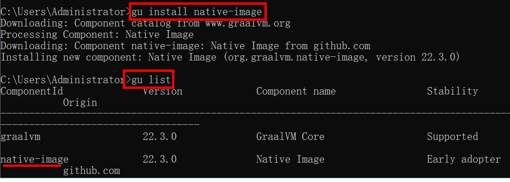
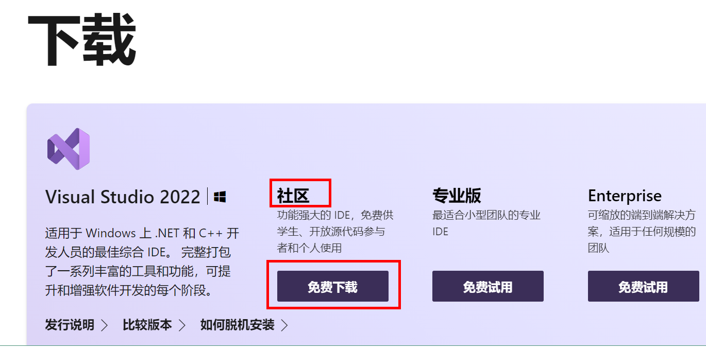
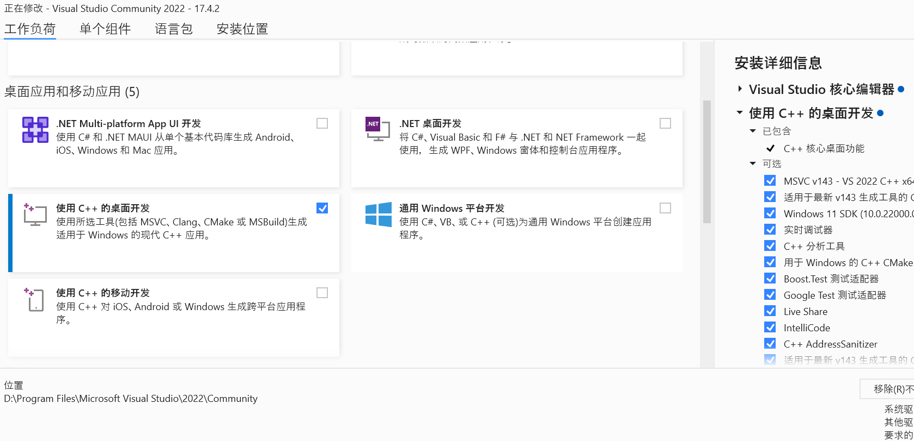
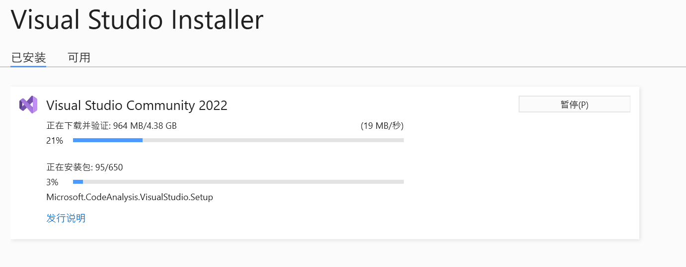
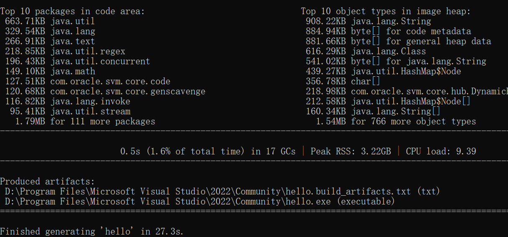
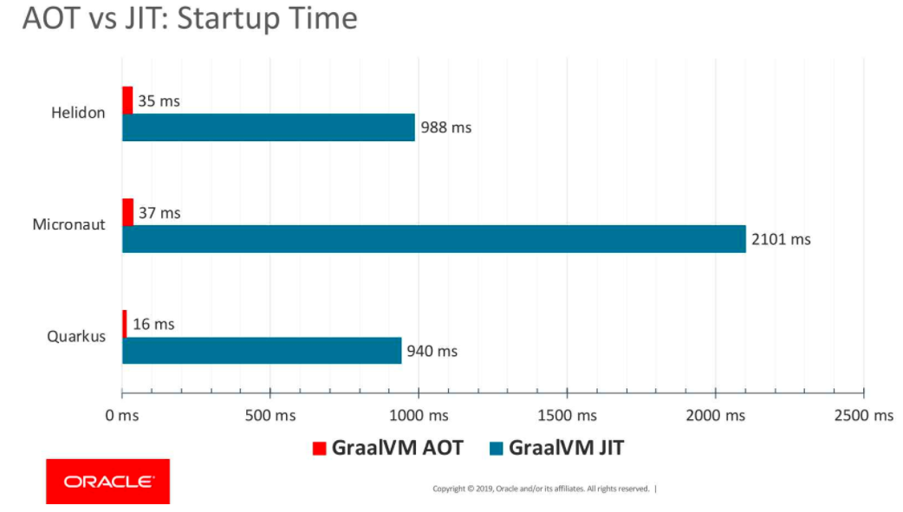

### 一、Spring框架概述

1.1 Spring 是轻量级的开源的 JavaEE 框架。

1.2 Spring 可以解决企业应用开发的复杂。

1.3 Spring 有两个核心部分：IOC 和 AOP。

- IOC：控制反转，把创建对象过程交给Spring进行管理。
- AOP：面向切面，不修改源代码进行功能增强。

1.4 Spring 特点：

- 方便解耦，简化开发。
- AOP编程支持。
- 方便程序测试。
- 方便和其他框架进行整合。
- 方便进行事务操作。
- 降低API开发难度。

### 二、IOC容器

#### 2.1 IOC概念和原理

##### 2.1.1 概念：

- 控制反转，把创建对象和对象的调用过程交给spring进行管理。
- 目的：降低耦合度。
- 底层原理：xml，反射，工厂模式。
- Spring提供IOC容器两种实现方式（两个接口）
  - **BeanFactory**：Spring内部使用的接口，不提倡开发人员使用。特点：加载配置文件时不会创建对象，获取对象时才会创建对象。
  - **ApplicationContext**：BeanFactory的子接口，提供了更多更强大的功能，一般由开发人员使用。特点：加载配置文件时会把配置文件里面的对象进行创建。
  - ApplicationContext两个常用实现类：
    - FileSystemXmlApplication：绝对路径，从盘符开始算起。
    - ClassPathXmlAppliation：相对路径，从src开始算起。


什么是Bean管理？Bean管理是指两个操作：Spring创建对象和Spring注入属性。

Bean管理有两种操作方式：基于xml配置文件方式实现和基于注解方式实现。

##### 2.1.2 IOC操作Bean管理（基于xml）

**xml实现Bean管理**

1. 基于xml方式创建对象：

> //配置User对象
>
> <bean id="user" class="com.yooome.spring6.User"></bean>

- 在Spring配置文件中使用bean标签来创建对象。
- bean标签有很多属性，常用属性：
  - id：唯一标识
  - class：类路径

- 创建对象时，默认执行无参构造函数

2. 基于xml方式注入属性：

**第一种方法**：使用set方法进行注入：

首先为类的属性提供set方法：

```java
public class User {

    private String userName;
    private String userAge;

    public void setUserName(String userName) {
        this.userName = userName;
    }

    public void setUserAge(String userAge) {
        this.userAge = userAge;
    }

    public String getUserName() {
        return userName;
    }

    public String getUserAge() {
        return userAge;
    }
}


```

然后再xml配置文件中通过property标签进行属性注入

```xml
    <!--配置User对象-->
    <bean id="user" class="com.yooome.spring6.User">
        <property name="userName" value="haha"></property>
        <property name="userAge" value="18"></property>
    </bean>
```

这样就完了

```java
ApplicationContext applicationContext = new ClassPathXmlApplicationContext("bean1.xml");
applicationContext.getBean("user",User.class);
System.out.println(user.getUserName() + " " + user.getUserAge());
```

**第二种方法**：使用有参数构造函数进行注入

首先提供有参构造方法：

```java
public class User {

    private String userName;
    private String userAge;

    public User(String userName, String userAge){
        this.userName = userName;
        this.userAge = userAge;
    }
}

```

然后再xml配置文件中通过construct-arg标签进行属性注入

```xml
    <!--配置User对象-->
    <bean id="user" class="com.yooome.spring6.User">
        <property name="userName" value="haha"></property>
        <property name="userAge" value="18"></property>
    </bean>
```

**第三种方法**：p名称空间注入（了解即可）

首先在xml配置文件中添加p名称空间，并且在bean标签中进行操作


然后提供set方法

```java
public class User {

    private String userName;
    private String userAge;

    public User() {
    }

    public void setUserName(String userName) {
        this.userName = userName;
    }

    public void setUserAge(String userAge) {
        this.userAge = userAge;
    }
}

```

3. xml注入其他属性

- null 值

```xml
    <!--配置User对象-->
    <bean id="user" class="com.yooome.spring6.User">
        <property name="userName"> <null/> </property>
    </bean>
```

- 属性值包含特殊符号

假设现在userName属性需要赋值为<haha>

如果像上面那样直接在value中声明的话会报错，因为包含特殊符号 <>


需要通过<![CDATA[值]]>


- 注入属性-外部bean

有两个类：UserService 和 UserDaoImpl ,其中 UserDaoImpl 实现UserDao接口

```java
public class UserService{
  private UserDao userDao;
  public void setUserDao(UserDao userDao){
    this.userDao = userDao;
  }
  
  public void add() {
    System.out.println("add");
  }
}
```

通过ref来制定创建userDaoImpl

```xml
<bean id="userDaoImpl" class="com.yooome.spring6.UserDaoImpl"></bean>

<bean id="userService" class="com.yooome.spring6.UserService">
    <property name="userDao" ref="userDaoImpl"></property>
</bean>

```

- 注入属性-内部bean

不通过ref属性，而是通过嵌套一个bean标签实现

```xml
<!--内部 bean-->
<bean id="emp" class="com.yooome.spring5.bean.Emp">
     <!--设置两个普通属性-->
     <property name="ename" value="lucy"></property>
     <property name="gender" value="女"></property>
     <!--设置对象类型属性-->
     <property name="dept">
         <bean id="dept" class="com.yooome.spring6.bean.Dept">
        	 <property name="dname" value="安保部"></property>
         </bean>
     </property>
</bean>
```

- 注入属性-级联赋值

写法一：也就是上面所说的外部bean，通过ref属性来获取外部bean。

写法二：

emp 类中有 ename 和 dept 两个属性，其中 dept 有 dname 属性，写法二需要 emp 提供 dept 属性的 get 方法。

```xml
<!--级联赋值-->
<bean id="emp" class="com.yooome.spring6.bean.Emp">
    <!--设置两个普通属性-->
    <property name="ename" value="lucy"></property> <property name="gender" value="女"></property>
    <!--写法一-->
	<property name="dept" ref="dept"></property>
    <!--写法二-->
    <property name="dept.dname" value="技术部"></property>
</bean>
<bean id="dept" class="com.yooome.spring6.bean.Dept">
    <property name="dname" value="财务部"></property>
</bean>

```

6. 注入集合属性（数组，List，Map）

假设有一个Stu类

```java
public class Stu {

    private String[] courses;
    private List<String> list;
    private Map<String,String> map;
    private Set<String> set;

    public void setCourses(String[] courses) {
        this.courses = courses;
    }

    public void setList(List<String> list) {
        this.list = list;
    }

    public void setMap(Map<String, String> map) {
        this.map = map;
    }

    public void setSet(Set<String> set) {
        this.set = set;
    }
}

```

在xml配置文件中对这些集合属性进行注入

```xml
<bean id="stu" class="com.yooome.spring6.Stu">
    <!--数组类型属性注入-->
    <property name="courses">
        <array>
            <value>java课程</value>
            <value>数据库课程</value>
        </array>
    </property>
    <!--List类型属性注入-->
    <property name="list">
        <list>
            <value>张三</value>
            <value>李四</value>
        </list>
    </property>
    <!--Map类型属性注入-->
    <property name="map">
        <map>
            <entry key="JAVA" value="java"></entry>
            <entry key="PHP" value="php"></entry>
        </map>
    </property>
    <!--Set类型属性注入-->
    <property name="set">
        <set>
            <value>Mysql</value>
            <value>Redis</value>
        </set>
    </property>
</bean>

```

- 上面的集合值都是字符串，如果是对象的话，如下：

写法：集合 + 外部 bean

```xml
<!--创建多个 course 对象-->
<bean id="course1" class="com.yooome.spring6.collectiontype.Course">
	<property name="cname" value="Spring6 框架"></property>
</bean>
<bean id="course2" class="com.yooome.spring6.collectiontype.Course">
	<property name="cname" value="MyBatis 框架"></property>
</bean>

<!--注入 list 集合类型，值是对象-->
<property name="courseList">
    <list>
        <ref bean="course1"></ref>
        <ref bean="course2"></ref>
    </list>
</property>

```

- 把集合注入部分提取出来

使用util标签，这样不同的bean都可以使用相同的集合注入部分了。

```xml
<util:list id="booklist">
	<value>已经加</value>
  <value>九阳神功</value>
</util:list>
<bean id="book" class="com.yooome.spring6.Book">
	<property name="list" ref="booklist"></property>
</bean>
```

- FactoryBean

Spring有两种Bean，一种普通的Bean，另一种是工厂Bean（FactoryBean）

这块看不太懂，不知道有啥用，先放着。

#### 2.2 Bean的作用域

##### 2.2.1 在Spring中，默认情况下bean是单实例对象。


##### 2.2.2 通过bean标签的scope属性来设置但实力还是多实例。

###### 2.2.2.1 Scope属性值：

- **singleton**：默认值，表示但实例对象。加载配置文件时就会创建单实例对象。
- **property**：表示多实例对象。不是加载配置文件时创建对象，在调用getBean方法时创建多实例对象。


执行结果不同：


#### 2.3 Bean的生命周期

##### 2.3.1 bean的生命周期

1. 通过构造器创建 bean 实例(无参构造)
2. 为 bean 的属性设置和对其他 bean 引用（调用set方法）
3. 把 bean 实例传递 bean 后置处理器的方法 **postProcessBeforeInitialization**（初始化前的后置处理器）
4. 调用 bean 的初始化的方法（需要进行配置初始化的方法）
5. 把 bean 实例传递 bean 后置处理器的方法 **postProcessAfterInitialization** （初始化后的后置处理器）
6. bean 可以使用了（对象获取到了）
7. 当容器关闭时候，调用 bean 的销毁的方法（需要进行配置销毁的方法）

##### 2.3.2 演示bean的生命周期

```java
public class Orders {
    private String orderName;

    public Orders() {
        System.out.println("第一步：执行无参构造方法创建bean实例");
    }

    public void setOrderName(String orderName) {
        this.orderName = orderName;
        System.out.println("第二步：调用set方法设置属性值");
    }

    //初始化方法
    public void initMethod(){
        System.out.println("第四步：执行初始化方法");
    }

    //销毁方法
    public void destroyMethod(){
        System.out.println("第七步：执行销毁方法");
    }
}

```

```java
//实现后置处理器，需要实现BeanPostProcessor接口
public class MyBeanPost implements BeanPostProcessor {

    @Override
    public Object postProcessBeforeInitialization(Object bean, String beanName) throws BeansException {
        System.out.println("第三步：将bean实例传递给bean后置处理器的postProcessBeforeInitialization方法");
        return bean;
    }

    @Override
    public Object postProcessAfterInitialization(Object bean, String beanName) throws BeansException {
        System.out.println("第五步：将bean实例传递给bean后置处理器的postProcessAfterInitialization方法");
        return bean;
    }
}

```

```xml
<bean id="orders" class="com.oymn.spring5.Orders" init-method="initMethod" destroy-method="destroyMethod">
    <property name="orderName" value="hahah"></property>
</bean>

<!--配置bean后置处理器，这样配置后整个xml里面的bean用的都是这个后置处理器-->
<bean id="myBeanPost" class="com.yooome.spring6.MyBeanPost"></bean>

```

```java
@Test
public void testOrders(){

    ClassPathXmlApplicationContext context = new ClassPathXmlApplicationContext("bean1.xml");

    Orders orders = context.getBean("orders", Orders.class);

    System.out.println("第六步：获取bean实例对象");
    System.out.println(orders);

    //手动让bean实例销毁
    context.close();
}

```


##### 2.3.3 xml自动装配

- 根据指定的配置规则（属性名称或者属性类型），Spring自动将匹配的属性进行注入。
- 根据属性名称自动装配：要求 emp 中属性的名称 dept 和 bean 标签的id值dept一样，才能识别。

```xml
<bean id="emp" class="com.yooome.spring6.Emp" autowire="byName"></bean>
<bean id="dept" class="com.yooome.spring6.Dept"></bean>
```

##### 2.3.4 通过外部属性文件来操作bean：

例如配置数据库信息：

1. 导入德鲁伊连接池jar包。
2. 创建外部属性文件，properties格式文件，写数据库信息。


3. 引入context名称空间，并通过context标签引入外部属性文件，使用 ”${}“ 来获取文件中对应的值



#### 2.4 IOC操作Bean管理（基于注解）

- 格式：@注解名称（属性名=属性值，属性名=属性值，......)
- 注解可以作用在类，属性，方法。
- 使用注解的目的：简化xml配置。

##### 2.4.1 基于注解创建对象

spring提供了四种创建对象的注解：

- @Component：一般用于配置文件
- @Service：一般用于Service层

- @Controller： 一般用于web层
- @Respository：一般用于Dao层

流程：

1. 引入依赖。
2. 开启组件扫描：扫描base-package包下所有有注解的类并为其创建对象。

```xml
<context:component-scan base-package="com.yooome"></context:component-scan>
```

3. com.yooome.spring6.Service有一个stuService类。

```java
//这里通过@Component注解来创建对象,括号中value的值等同于之前xml创建对象使用的id,为了后面使用时通过id来获取对象
//括号中的内容也可以省略,默认是类名并且首字母小写
//可以用其他三个注解
@Component(value="stuService")
public class StuService {
    public void add(){
        System.out.println("addService");
    }
}
```

4. 这样就可以通过getBean方法来获取stuService对象了

```java
ClassPathXmlApplicationContext context = new ClassPathXmlApplicationContext("bean4.xml");
StuService stuService = context.getBean("stuService", StuService.class);
System.out.println(stuService);
stuService.add();
```

##### 2.4.2 开启组件扫描的细节配置：

1. use-default-fileters 设置为false表示不适用默认过滤器，通过include-filter来设置只扫描com.yooome包下的所有 @Controller修饰的类。

```xml
<context:component-scan base-package="com.yooome" use-default-filters="false">
    <context:include-filter type="annotation" expression="org.springframework.stereotype.Controller"/>
</context:component-scan>
```

2. Exclude-filter设置那些注解不被扫描，例子中为@Controller修饰的类不被扫描

```xml
<context:component-scan base-package="com.yooome">
    <context:exclude-filter type="annotation" expression="org.springframework.stereotype.Controller"/>
</context:component-scan>
```

##### 2.4.3 基于注解进行属性注入：

①场景一：Autowird属性注入

- @Autowird：根据属性类型自动装配【默认是byType】

查看源码：

```java
package org.springframework.beans.factory.annotation;

import java.lang.annotation.Documented;
import java.lang.annotation.ElementType;
import java.lang.annotation.Retention;
import java.lang.annotation.RetentionPolicy;
import java.lang.annotation.Target;

@Target({ElementType.CONSTRUCTOR, ElementType.METHOD, ElementType.PARAMETER, ElementType.FIELD, ElementType.ANNOTATION_TYPE})
@Retention(RetentionPolicy.RUNTIME)
@Documented
public @interface Autowired {
    boolean required() default true;
}

```

源码中有两处需要注意：

- 第一处：该注解可以标注在哪里？
  1. 构造方法上。
  2. 方法上。
  3. 形参上。
  4. 属性上。
  5. 注解上。

- 第二处：该注解有一个requirde属性，默认值是true，表示在注入的时候要求背注入的Bean必须是存在的，如果不存在则报错。如果required 属性设置为false，表示注入的Bean存在或者不存在都没关系，存在的话就注入，不存在的话，也不报错。

创建 StuDao 接口和 StuDaoImpl 实现类，为 StuDaoImpl 添加创建对象注解

```java
public interface StuDao {
    public void add();
}
```

```java
@Repository
public class StuDaoImpl implements StuDao {
    @Override
    public void add() {
        System.out.println("StuDaoImpl");
    }
}
```

StuService 类中添加StuDao属性，为其添加 @Autowire 注解，spring回地总为stuDao属性创建StuDaoImpl对象。

```java
@Component(value="stuService")
public class StuService {
    
    @Autowired
    public StuDao stuDao;

    public void add(){
        System.out.println("addService");
        stuDao.add();
    }
}
```

```java
@Test
public void test1(){
    ClassPathXmlApplicationContext context = new ClassPathXmlApplicationContext("bean4.xml");
    StuService stuService = context.getBean("stuService", StuService.class);
    System.out.println(stuService);
    stuService.add();
}
```

②场景二：set注入

UserServiceImpl 类

```java
@Service
public class UserServiceImpl implements UserService {
    private UserDao userDao;
    @Autowired
    public void setUserDao(UserDao userDao) {
        this.userDao = userDao;
    }

    @Override
    public void addUser() {
        userDao.addUser();
        System.out.println("完成添加user信息");
    }
}
```

UserDao类

```java
package com.yooome.bennet.dao;

public interface UserDao {
    void addUser();
}

```

UserDaoImpl 类

```java
package com.yooome.bennet.dao.impl;

import com.yooome.bennet.dao.UserDao;
import org.springframework.stereotype.Repository;

@Repository
public class UserDaoImpl implements UserDao {

    @Override
    public void addUser() {
        System.out.println("dao add user");
    }
}
```


③场景三：构造方法注入

修改UserServiceImpl类

```java
package com.yooome.bennet.service.impl;

import com.yooome.bennet.dao.UserDao;
import com.yooome.bennet.service.UserService;
import org.springframework.beans.factory.annotation.Autowired;
import org.springframework.stereotype.Service;

@Service
public class UserServiceImpl implements UserService {
    private UserDao userDao;

    @Autowired
    public UserServiceImpl(UserDao userDao) {
        this.userDao = userDao;
    }

    @Override
    public void addUser() {
        userDao.addUser();
        System.out.println("完成添加user信息");
    }
}
```

```java
package com.yooome.bennet.controller;

import com.yooome.bennet.service.UserService;
import com.yooome.bennet.spring6.User;
import org.springframework.beans.factory.annotation.Autowired;
import org.springframework.web.bind.annotation.GetMapping;
import org.springframework.web.bind.annotation.PostMapping;
import org.springframework.web.bind.annotation.RestController;

@RestController
public class UserController {
    @Autowired
    private UserService userService;
    @PostMapping("/post/user")
    public void addUser() {
        userService.addUser();
        System.out.println("post 添加用户信息");
    }
}
```


④场景四：形参上注入

修改UserServiceImpl类

```java
package com.yooome.bennet.service.impl;

import com.yooome.bennet.dao.UserDao;
import com.yooome.bennet.service.UserService;
import org.springframework.beans.factory.annotation.Autowired;
import org.springframework.stereotype.Service;

@Service
public class UserServiceImpl implements UserService {
    private UserDao userDao;

    @Autowired
    public UserServiceImpl(UserDao userDao) {
        this.userDao = userDao;
    }

    @Override
    public void addUser() {
        userDao.addUser();
        System.out.println("完成添加user信息");
    }
}
```

修改UserController类

```java
package com.yooome.bennet.controller;

import com.yooome.bennet.service.UserService;
import com.yooome.bennet.spring6.User;
import org.springframework.beans.factory.annotation.Autowired;
import org.springframework.web.bind.annotation.GetMapping;
import org.springframework.web.bind.annotation.PostMapping;
import org.springframework.web.bind.annotation.RestController;

@RestController
public class UserController {

    private UserService userService;
    @GetMapping("/get/user")
    public User getUser() {
        User user = new User();
        user.setUserAge(18);
        user.setUserName("张三");
        return user;
    }
    @PostMapping("/post/user")
    public void addUser() {
        userService.addUser();
        System.out.println("post 添加用户信息");
    }

    public UserController(@Autowired UserService userService) {
        this.userService = userService;
    }
}
```

当有参数的构造方法只有一个时，@Autowired注解可以设略。

⑥场景六：@Autowired注解和@Qualifier注解联合

```java
package com.yooome.spring6.dao.impl;

import com.yooome.spring6.dao.UserDao;
import org.springframework.stereotype.Repository;

@Repository
public class UserDaoRedisImpl implements UserDao {

    @Override
    public void print() {
        System.out.println("Redis Dao层执行结束");
    }
}
```

测试：测试异常。

错误信息中说：不能装配，UserDao这个Bean的数量等于 2

怎么解决这个问题呢？当然要byName，根据名称进行装配了。

修改UserServiceImple 类

```java
package com.yooome.spring6.service.impl;

import com.yooome.spring6.dao.UserDao;
import com.yooome.spring6.service.UserService;
import org.springframework.beans.factory.annotation.Autowired;
import org.springframework.stereotype.Service;

@Service
public class UserServiceImpl implements UserService {

    @Autowired
    @Qualifier("userDaoImpl") // 指定bean的名字
    private UserDao userDao;

    @Override
    public void out() {
        userDao.print();
        System.out.println("Service层执行结束");
    }
}
```

**总结**：

- @Autowired注解可以出现在：属性上，构造方法上，构造方法的参数上，setter方法上。
- 当参数的构造方法只有一个，@Autowired注解可以省略。
- @Autowired注解默认根据类型注入。如果要根据名称注入的话没需要配合@Qualifier注解一起使用。

#### 2.5 实验二：@Resource注入

@Resource 注解也可以完成属性注入。那他和@Autowired注解有什么区别呢？

- @Resource 注解是JDK扩展包中的，也就是说属于JDK的一部分，所以该注解是标准注解，更加具有通用性。（JSR-250标准中制定的注解类型。JSR是Java规范提案。）
- @Autowired 注解是Spring 框架自己的。
- @Resource注解默认根据装配byName，为指定name时，使用属性名作为name。通过name找不到的话会自动启动通过类型 byType 装配。
- @Resource 注解用在属性上，setter方法上。
- @Autowired注解用在属性上，setter方法上，构造方法上，构造方法参数上。

@Resource 注解属于JDK扩展包，所以不再JDK当中，需要额外引入一下依赖：【如果是JDK8的话不需要额外引入依赖。高于JDK11或低于JDK8需要引入以下依赖。】

```xml
<dependency>
    <groupId>jakarta.annotation</groupId>
    <artifactId>jakarta.annotation-api</artifactId>
    <version>2.1.1</version>
</dependency>
```

源码：

```java
package jakarta.annotation;

import java.lang.annotation.ElementType;
import java.lang.annotation.Repeatable;
import java.lang.annotation.Retention;
import java.lang.annotation.RetentionPolicy;
import java.lang.annotation.Target;

@Target({ElementType.TYPE, ElementType.FIELD, ElementType.METHOD})
@Retention(RetentionPolicy.RUNTIME)
@Repeatable(Resources.class)
public @interface Resource {
    String name() default "";

    String lookup() default "";

    Class<?> type() default Object.class;

    Resource.AuthenticationType authenticationType() default Resource.AuthenticationType.CONTAINER;

    boolean shareable() default true;

    String mappedName() default "";

    String description() default "";

    public static enum AuthenticationType {
        CONTAINER,
        APPLICATION;

        private AuthenticationType() {
        }
    }
}
```

①**场景一**：**根据name注入** 

修改UserDaoImpl类

```java
package com.yooome.spring6.dao.impl;

import com.yooome.spring6.dao.UserDao;
import org.springframework.stereotype.Repository;

@Repository("myUserDao")
public class UserDaoImpl implements UserDao {

    @Override
    public void print() {
        System.out.println("Dao层执行结束");
    }
}
```

修改UserServiceImpl类

```java
package com.yooome.spring6.service.impl;

import com.yooome.spring6.dao.UserDao;
import com.yooome.spring6.service.UserService;
import jakarta.annotation.Resource;
import org.springframework.beans.factory.annotation.Autowired;
import org.springframework.beans.factory.annotation.Qualifier;
import org.springframework.stereotype.Service;

@Service
public class UserServiceImpl implements UserService {

    @Resource(name = "myUserDao")
    private UserDao myUserDao;

    @Override
    public void out() {
        myUserDao.print();
        System.out.println("Service层执行结束");
    }
}
```

测试通过

②**场景二**：**name位置注入**

修改UserDaoImpl类

```java
package com.yooome.spring6.dao.impl;

import com.yooome.spring6.dao.UserDao;
import org.springframework.stereotype.Repository;

@Repository("myUserDao")
public class UserDaoImpl implements UserDao {

    @Override
    public void print() {
        System.out.println("Dao层执行结束");
    }
}
```

修改UserServiceImpl类

```java
package com.yooome.spring6.service.impl;

import com.yooome.spring6.dao.UserDao;
import com.yooome.spring6.service.UserService;
import jakarta.annotation.Resource;
import org.springframework.beans.factory.annotation.Autowired;
import org.springframework.beans.factory.annotation.Qualifier;
import org.springframework.stereotype.Service;

@Service
public class UserServiceImpl implements UserService {

    @Resource
    private UserDao myUserDao;

    @Override
    public void out() {
        myUserDao.print();
        System.out.println("Service层执行结束");
    }
}
```

测试通过

当@Resource 注解使用时没有指定name的时候，还是根据name进行查找，这个name是属性名称。

③**场景三 其它情况**

修改UserServiceImpl 类，userDao1 属性名不存在。

```java
package com.yooome.spring6.service.impl;

import com.yooome.spring6.dao.UserDao;
import com.yooome.spring6.service.UserService;
import jakarta.annotation.Resource;
import org.springframework.beans.factory.annotation.Autowired;
import org.springframework.beans.factory.annotation.Qualifier;
import org.springframework.stereotype.Service;

@Service
public class UserServiceImpl implements UserService {

    @Resource
    private UserDao userDao1;

    @Override
    public void out() {
        userDao1.print();
        System.out.println("Service层执行结束");
    }
}
```

测试异常

根据异常信息得知：显然当通过name找不到的时候，自然会启动byType进行注入，以上的错误是因为UserDao接口下有两个实现类导致的。所以根据类型注入就会报错。

@Resource的set注入可以自行测试。

**总结**：

**@Resource注解**：默认byName注入，**没有指定name时把属性名当做name**，**根据name找不到时**，**才会byType注入**。**byType注入时，某种类型的Bean只能有一个**。

#### 2.6 Spring全注解开发

全注解开发就是不再使用spring配置文件了，写一个配置类来代替配置文件。

```java
package com.yooome.spring6.config;

import org.springframework.context.annotation.ComponentScan;
import org.springframework.context.annotation.Configuration;

@Configuration
//@ComponentScan({"com.yooome.spring6.controller", "com.yooome.spring6.service","com.yooome.spring6.dao"})
@ComponentScan("com.yooome.spring6")
public class Spring6Config {
}
```

测试类

```java
@Test
public void testAllAnnotation(){
    ApplicationContext context = new AnnotationConfigApplicationContext(Spring6Config.class);
    UserController userController = context.getBean("userController", UserController.class);
    userController.out();
    logger.info("执行成功");
}
```

### 三、原理-手写IOC

我们都知道，Spring框架的IOC是基于Java反射机制实现的，下面我们先回顾一下 java 反射。

#### 3.1 回顾Java反射

Java 反射机制是在运行状态中，对于任意一个类，都能够知道这个类的所有属性和方法；对于任意一个对象，都能够调用它的任意方法和属性；这种动态获取信息以及动态调用对象方法的功能成为Java 语言的反射机制。简单来说，反射机制指的是程序在运行时能够获取自身的信息。

要想解剖一个类，必须先要获取到该类的Class对象。而剖析一个类或用反射解决具体的问题就是使用相关API

- java.lang.Class
- java.lang.reflect。所以，Class对象是反射的根源。

自定义类

```java
package com.yooome.reflect;

public class Car {

    //属性
    private String name;
    private int age;
    private String color;

    //无参数构造
    public Car() {
    }

    //有参数构造
    public Car(String name, int age, String color) {
        this.name = name;
        this.age = age;
        this.color = color;
    }

    //普通方法
    private void run() {
        System.out.println("私有方法-run.....");
    }

    //get和set方法
    public String getName() {
        return name;
    }
    public void setName(String name) {
        this.name = name;
    }
    public int getAge() {
        return age;
    }
    public void setAge(int age) {
        this.age = age;
    }
    public String getColor() {
        return color;
    }
    public void setColor(String color) {
        this.color = color;
    }

    @Override
    public String toString() {
        return "Car{" +
                "name='" + name + '\'' +
                ", age=" + age +
                ", color='" + color + '\'' +
                '}';
    }
}
```

编写测试类

```java
package com.yooome.reflect;

import org.junit.jupiter.api.Test;
import java.lang.reflect.Constructor;
import java.lang.reflect.Field;
import java.lang.reflect.Method;

public class TestCar {

    //1、获取Class对象多种方式
    @Test
    public void test01() throws Exception {
        //1 类名.class
        Class clazz1 = Car.class;

        //2 对象.getClass()
        Class clazz2 = new Car().getClass();

        //3 Class.forName("全路径")
        Class clazz3 = Class.forName("com.yooome.reflect.Car");

        //实例化
        Car car = (Car)clazz3.getConstructor().newInstance();
        System.out.println(car);
    }

    //2、获取构造方法
    @Test
    public void test02() throws Exception {
        Class clazz = Car.class;
        //获取所有构造
        // getConstructors()获取所有public的构造方法
//        Constructor[] constructors = clazz.getConstructors();
        // getDeclaredConstructors()获取所有的构造方法public  private
        Constructor[] constructors = clazz.getDeclaredConstructors();
        for (Constructor c:constructors) {
            System.out.println("方法名称："+c.getName()+" 参数个数："+c.getParameterCount());
        }

        //指定有参数构造创建对象
        //1 构造public
//        Constructor c1 = clazz.getConstructor(String.class, int.class, String.class);
//        Car car1 = (Car)c1.newInstance("夏利", 10, "红色");
//        System.out.println(car1);
        
        //2 构造private
        Constructor c2 = clazz.getDeclaredConstructor(String.class, int.class, String.class);
        c2.setAccessible(true);
        Car car2 = (Car)c2.newInstance("捷达", 15, "白色");
        System.out.println(car2);
    }

    //3、获取属性
    @Test
    public void test03() throws Exception {
        Class clazz = Car.class;
        Car car = (Car)clazz.getDeclaredConstructor().newInstance();
        //获取所有public属性
        //Field[] fields = clazz.getFields();
        //获取所有属性（包含私有属性）
        Field[] fields = clazz.getDeclaredFields();
        for (Field field:fields) {
            if(field.getName().equals("name")) {
                //设置允许访问
                field.setAccessible(true);
                field.set(car,"五菱宏光");
                System.out.println(car);
            }
            System.out.println(field.getName());
        }
    }

    //4、获取方法
    @Test
    public void test04() throws Exception {
        Car car = new Car("奔驰",10,"黑色");
        Class clazz = car.getClass();
        //1 public方法
        Method[] methods = clazz.getMethods();
        for (Method m1:methods) {
            //System.out.println(m1.getName());
            //执行方法 toString
            if(m1.getName().equals("toString")) {
                String invoke = (String)m1.invoke(car);
                //System.out.println("toString执行了："+invoke);
            }
        }

        //2 private方法
        Method[] methodsAll = clazz.getDeclaredMethods();
        for (Method m:methodsAll) {
            //执行方法 run
            if(m.getName().equals("run")) {
                m.setAccessible(true);
                m.invoke(car);
            }
        }
    }
}
```

#### 3.2 实现Spring 的 Ioc

我们知道，Ioc （控制反转）和DI（依赖注入）是Spring里面核心的东西，name，我们如何自己手写出这样的代码呢？下面我们就一步一步写出Spring框架最核心的部分。

##### 3.2.1 搭建子模块

搭建子模块：guigu-spring 搭建方式如其他Spring子模块。

##### 3.2.2 准备测试需要的bean

```xml
<dependencies>
    <!--junit5测试-->
    <dependency>
        <groupId>org.junit.jupiter</groupId>
        <artifactId>junit-jupiter-api</artifactId>
        <version>5.3.1</version>
    </dependency>
</dependencies>
```

创建UserDao接口

```java
public interface UserDao {
  
  public void print();
}
```

创建UserDaoImpl实现

```java
public class UserDaoImpl implements UserDao {
  @Override
  public void print() {
    System.out.println("Dao层执行结束");
  }
}
```

创建UserService接口

```java
public interface UserService {
  public void out();
}
```

创建UserServiceImpl实现类

```java
@Bean
public class UserServiceImpl implements UserService {
  @Override
  public void out() {
    System.out.println("Service层执行结束");
  }
}
```

③定义注解

我们通过注解的形式加载bean实现依赖注入

bean注解

```java
package com.yooome.spring.core.annotation;

import java.lang.annotation.ElementType;
import java.lang.annotation.Retention;
import java.lang.annotation.RetentionPolicy;
import java.lang.annotation.Target;

@Target(ElementType.TYPE)
@Retention(RetentionPolicy.RUNTIME)
public @interface Bean {
}
```

依赖注入注解

```java
package com.yooome.spring.core.annotation;

import java.lang.annotation.ElementType;
import java.lang.annotation.Retention;
import java.lang.annotation.RetentionPolicy;
import java.lang.annotation.Target;

@Target({ElementType.FIELD})
@Retention(RetentionPolicy.RUNTIME)
public @interface Di {
}
```

说明：上面两个注解可以随意取名

④**定义bean容器接口**

```java
public interface ApplicationContext {
  Object getBean(Class clazz);
}
```

⑤编写注解bean容器接口实现

AnnotationApplicationContext基于注解扫描bean

```java
public class AnnotationApplicationContext implements ApplicationContext {
  
  private HashMap<Class,Object> beanFactory = new HashMap<>();
  
  public Object getBean(Class clazz) {
    return beanFactory.get(clazz);
  }
  
  public AnnotationAplicationContext(String basePackage){
    
  }
}
```

⑥编写扫描bean逻辑

我们通过构造方法传入包的base路径扫描@Bean注解的 java 对象，完整代码如下：

```java
package com.yooome.spring.core;

import com.yooome.spring.core.annotation.Bean;

import java.io.File;
import java.util.HashMap;

public class AnnotationApplicationContext implements ApplicationContext {

    //存储bean的容器
    private HashMap<Class, Object> beanFactory = new HashMap<>();
    private static String rootPath;

    @Override
    public Object getBean(Class clazz) {
        return beanFactory.get(clazz);
    }

    /**
     * 根据包扫描加载bean
     * @param basePackage
     */
    public AnnotationApplicationContext(String basePackage) {
       try {
            String packageDirName = basePackage.replaceAll("\\.", "\\\\");
            Enumeration<URL> dirs =Thread.currentThread().getContextClassLoader().getResources(packageDirName);
            while (dirs.hasMoreElements()) {
                URL url = dirs.nextElement();
                String filePath = URLDecoder.decode(url.getFile(),"utf-8");
                rootPath = filePath.substring(0, filePath.length()-packageDirName.length());
                loadBean(new File(filePath));
            }

        } catch (Exception e) {
            throw new RuntimeException(e);
        }
    }

    private  void loadBean(File fileParent) {
        if (fileParent.isDirectory()) {
            File[] childrenFiles = fileParent.listFiles();
            if(childrenFiles == null || childrenFiles.length == 0){
                return;
            }
            for (File child : childrenFiles) {
                if (child.isDirectory()) {
                    //如果是个文件夹就继续调用该方法,使用了递归
                    loadBean(child);
                } else {
                    //通过文件路径转变成全类名,第一步把绝对路径部分去掉
                    String pathWithClass = child.getAbsolutePath().substring(rootPath.length() - 1);
                    //选中class文件
                    if (pathWithClass.contains(".class")) {
                        //    com.xinzhi.dao.UserDao
                        //去掉.class后缀，并且把 \ 替换成 .
                        String fullName = pathWithClass.replaceAll("\\\\", ".").replace(".class", "");
                        try {
                            Class<?> aClass = Class.forName(fullName);
                            //把非接口的类实例化放在map中
                            if(!aClass.isInterface()){
                                Bean annotation = aClass.getAnnotation(Bean.class);
                                if(annotation != null){
                                    Object instance = aClass.newInstance();
                                    //判断一下有没有接口
                                    if(aClass.getInterfaces().length > 0) {
                                        //如果有接口把接口的class当成key，实例对象当成value
                                        System.out.println("正在加载【"+ aClass.getInterfaces()[0] +"】,实例对象是：" + instance.getClass().getName());
                                        beanFactory.put(aClass.getInterfaces()[0], instance);
                                    }else{
                                        //如果有接口把自己的class当成key，实例对象当成value
                                        System.out.println("正在加载【"+ aClass.getName() +"】,实例对象是：" + instance.getClass().getName());
                                        beanFactory.put(aClass, instance);
                                    }
                                }
                            }
                        } catch (ClassNotFoundException | IllegalAccessException | InstantiationException e) {
                            e.printStackTrace();
                        }
                    }
                }
            }
        }
    }

}
```

⑦java类标识Bean注解

```java
@Bean
public class UserServiceImpl implements UserService
```

```java
@Bean
public class UserDaoImpl implements UserDao
```

⑧测试Bean加载

```java
package com.yooome.spring;

import com.yooome.spring.core.AnnotationApplicationContext;
import com.yooome.spring.core.ApplicationContext;
import com.yooome.spring.test.service.UserService;
import org.junit.jupiter.api.Test;

public class SpringIocTest {

    @Test
    public void testIoc() {
        ApplicationContext applicationContext = new AnnotationApplicationContext("com.yooome.spring.test");
        UserService userService = (UserService)applicationContext.getBean(UserService.class);
        userService.out();
        System.out.println("run success");
    }
}
```

控制台打印测试

⑨依赖注入

只要 userDao.print();调用成功，说明注入成功

```java
package com.yooome.spring.test.service.impl;

import com.yooome.spring.core.annotation.Bean;
import com.yooome.spring.core.annotation.Di;
import com.yooome.spring.dao.UserDao;
import com.yooome.spring.service.UserService;

@Bean
public class UserServiceImpl implements UserService {

    @Di
    private UserDao userDao;

    @Override
    public void out() {
        userDao.print();
        System.out.println("Service层执行结束");
    }
}
```

执行第八步：报错了，说明当前userDao是个空对象

⑩**依赖注入实现**

```java
package com.yooome.spring.core;

import com.yooome.spring.core.annotation.Bean;
import com.yooome.spring.core.annotation.Di;

import java.io.File;
import java.lang.reflect.Field;
import java.util.HashMap;
import java.util.Map;

public class AnnotationApplicationContext implements ApplicationContext {

    //存储bean的容器
    private HashMap<Class, Object> beanFactory = new HashMap<>();
    private static String rootPath;

    @Override
    public Object getBean(Class clazz) {
        return beanFactory.get(clazz);
    }

    /**
     * 根据包扫描加载bean
     * @param basePackage
     */
    public AnnotationApplicationContext(String basePackage) {
        try {
            String packageDirName = basePackage.replaceAll("\\.", "\\\\");
            Enumeration<URL> dirs =Thread.currentThread().getContextClassLoader().getResources(packageDirName);
            while (dirs.hasMoreElements()) {
                URL url = dirs.nextElement();
                String filePath = URLDecoder.decode(url.getFile(),"utf-8");
                rootPath = filePath.substring(0, filePath.length()-packageDirName.length());
                loadBean(new File(filePath));
            }

        } catch (Exception e) {
            throw new RuntimeException(e);
        }
        
        //依赖注入
        loadDi();
    }
    
    private  void loadBean(File fileParent) {
        if (fileParent.isDirectory()) {
            File[] childrenFiles = fileParent.listFiles();
            if(childrenFiles == null || childrenFiles.length == 0){
                return;
            }
            for (File child : childrenFiles) {
                if (child.isDirectory()) {
                    //如果是个文件夹就继续调用该方法,使用了递归
                    loadBean(child);
                } else {
                    //通过文件路径转变成全类名,第一步把绝对路径部分去掉
                    String pathWithClass = child.getAbsolutePath().substring(rootPath.length() - 1);
                    //选中class文件
                    if (pathWithClass.contains(".class")) {
                        //    com.xinzhi.dao.UserDao
                        //去掉.class后缀，并且把 \ 替换成 .
                        String fullName = pathWithClass.replaceAll("\\\\", ".").replace(".class", "");
                        try {
                            Class<?> aClass = Class.forName(fullName);
                            //把非接口的类实例化放在map中
                            if(!aClass.isInterface()){
                                Bean annotation = aClass.getAnnotation(Bean.class);
                                if(annotation != null){
                                    Object instance = aClass.newInstance();
                                    //判断一下有没有接口
                                    if(aClass.getInterfaces().length > 0) {
                                        //如果有接口把接口的class当成key，实例对象当成value
                                        System.out.println("正在加载【"+ aClass.getInterfaces()[0] +"】,实例对象是：" + instance.getClass().getName());
                                        beanFactory.put(aClass.getInterfaces()[0], instance);
                                    }else{
                                        //如果有接口把自己的class当成key，实例对象当成value
                                        System.out.println("正在加载【"+ aClass.getName() +"】,实例对象是：" + instance.getClass().getName());
                                        beanFactory.put(aClass, instance);
                                    }
                                }
                            }
                        } catch (ClassNotFoundException | IllegalAccessException | InstantiationException e) {
                            e.printStackTrace();
                        }
                    }
                }
            }
        }
    }

    private void loadDi() {
        for(Map.Entry<Class,Object> entry : beanFactory.entrySet()){
            //就是咱们放在容器的对象
            Object obj = entry.getValue();
            Class<?> aClass = obj.getClass();
            Field[] declaredFields = aClass.getDeclaredFields();
            for (Field field : declaredFields){
                Di annotation = field.getAnnotation(Di.class);
                if( annotation != null ){
                    field.setAccessible(true);
                    try {
                        System.out.println("正在给【"+obj.getClass().getName()+"】属性【" + field.getName() + "】注入值【"+ beanFactory.get(field.getType()).getClass().getName() +"】");
                        field.set(obj,beanFactory.get(field.getType()));
                    } catch (IllegalAccessException e) {
                        e.printStackTrace();
                    }
                }
            }
        }
    }

}
```

执行第八步：执行成功，依赖注入成功。

### 四、面向切面：AOP

#### 5.1 场景模拟

搭建子模块：spring6-aop

##### 5.1.1 声明接口

声明计算接口Calculator，包含加减乘除的抽象方法

```java
public interface Calculator {
    
    int add(int i, int j);
    
    int sub(int i, int j);
    
    int mul(int i, int j);
    
    int div(int i, int j);
    
}
```

##### 5.1.2 创建实现类

```java
public class CalculatorImpl implements Calculator {
    
    @Override
    public int add(int i, int j) {
    
        int result = i + j;
    
        System.out.println("方法内部 result = " + result);
    
        return result;
    }
    
    @Override
    public int sub(int i, int j) {
    
        int result = i - j;
    
        System.out.println("方法内部 result = " + result);
    
        return result;
    }
    
    @Override
    public int mul(int i, int j) {
    
        int result = i * j;
    
        System.out.println("方法内部 result = " + result);
    
        return result;
    }
    
    @Override
    public int div(int i, int j) {
    
        int result = i / j;
    
        System.out.println("方法内部 result = " + result);
    
        return result;
    }
}
```

##### 5.1.3 创建带日志功能的实现类



```java
public class CalculatorLogImpl implements Calculator {
    
    @Override
    public int add(int i, int j) {
    
        System.out.println("[日志] add 方法开始了，参数是：" + i + "," + j);
    
        int result = i + j;
    
        System.out.println("方法内部 result = " + result);
    
        System.out.println("[日志] add 方法结束了，结果是：" + result);
    
        return result;
    }
    
    @Override
    public int sub(int i, int j) {
    
        System.out.println("[日志] sub 方法开始了，参数是：" + i + "," + j);
    
        int result = i - j;
    
        System.out.println("方法内部 result = " + result);
    
        System.out.println("[日志] sub 方法结束了，结果是：" + result);
    
        return result;
    }
    
    @Override
    public int mul(int i, int j) {
    
        System.out.println("[日志] mul 方法开始了，参数是：" + i + "," + j);
    
        int result = i * j;
    
        System.out.println("方法内部 result = " + result);
    
        System.out.println("[日志] mul 方法结束了，结果是：" + result);
    
        return result;
    }
    
    @Override
    public int div(int i, int j) {
    
        System.out.println("[日志] div 方法开始了，参数是：" + i + "," + j);
    
        int result = i / j;
    
        System.out.println("方法内部 result = " + result);
    
        System.out.println("[日志] div 方法结束了，结果是：" + result);
    
        return result;
    }
}
```

##### 5.1.4 提出问题

**①现在代码缺陷**

针对带日志功能的实现类，我们发现有如下缺陷：

- 对核心业务功能有干扰，导致程序员在开发核心业务功能是分散了精力。
- 附加功能分散在各个业务功能方法中不利于统一维护。

②解决思路

结局思路，核心就是：解耦。我们需要把附加功能从业务功能代码中抽取出来。

③困难

解决问题的困难：要抽取的代码在方法内部，靠以前把子类中的重复代码抽取到父类的方式没法解决。所以需要引入新的技术。


### 十一、提前编译：AOT


#### 11.1 AOT概述

##### 11.1.1 JIT与AOT的区别

JIT和AOT 这个名词是指两种不同的编译方式，这两种编译方式的主要区别在于是否在“运行时”进行编译

**（1）JIT， Just-in-time,动态(即时)编译，边运行边编译；**

在程序运行时，根据算法计算出热点代码，然后进行 JIT 实时编译，这种方式吞吐量高，有运行时性能加成，可以跑得更快，并可以做到动态生成代码等，但是相对启动速度较慢，并需要一定时间和调用频率才能触发 JIT 的分层机制。JIT 缺点就是编译需要占用运行时资源，会导致进程卡顿。

**（2）AOT，Ahead Of Time，指运行前编译，预先编译。**

AOT 编译能直接将源代码转化为机器码，内存占用低，启动速度快，可以无需 runtime 运行，直接将 runtime 静态链接至最终的程序中，但是无运行时性能加成，不能根据程序运行情况做进一步的优化，AOT 缺点就是在程序运行前编译会使程序安装的时间增加。                                                           

**简单来讲：**JIT即时编译指的是在程序的运行过程中，将字节码转换为可在硬件上直接运行的机器码，并部署至托管环境中的过程。而 AOT 编译指的则是，在程序运行之前，便将字节码转换为机器码的过程。

```
.java -> .class -> (使用jaotc编译工具) -> .so（程序函数库,即编译好的可以供其他程序使用的代码和数据）
```


**（3）AOT的优点**

**简单来讲，**Java 虚拟机加载已经预编译成二进制库，可以直接执行。不必等待及时编译器的预热，减少 Java 应用给人带来“第一次运行慢” 的不良体验。

在程序运行前编译，可以避免在运行时的编译性能消耗和内存消耗
可以在程序运行初期就达到最高性能，程序启动速度快
运行产物只有机器码，打包体积小

**AOT的缺点**

由于是静态提前编译，不能根据硬件情况或程序运行情况择优选择机器指令序列，理论峰值性能不如JIT
没有动态能力，同一份产物不能跨平台运行

第一种即时编译 (JIT) 是默认模式，Java Hotspot 虚拟机使用它在运行时将字节码转换为机器码。后者提前编译 (AOT)由新颖的 GraalVM 编译器支持，并允许在构建时将字节码直接静态编译为机器码。

现在正处于云原生，降本增效的时代，Java 相比于 Go、Rust 等其他编程语言非常大的弊端就是启动编译和启动进程非常慢，这对于根据实时计算资源，弹性扩缩容的云原生技术相冲突，Spring6 借助 AOT 技术在运行时内存占用低，启动速度快，逐渐的来满足 Java 在云原生时代的需求，对于大规模使用 Java 应用的商业公司可以考虑尽早调研使用 JDK17，通过云原生技术为公司实现降本增效。


##### 11.1.2 Graalvm

Spring6 支持的 AOT 技术，这个 GraalVM  就是底层的支持，Spring 也对 GraalVM 本机映像提供了一流的支持。GraalVM 是一种高性能 JDK，旨在加速用 Java 和其他 JVM 语言编写的应用程序的执行，同时还为 JavaScript、Python 和许多其他流行语言提供运行时。 GraalVM 提供两种运行 Java 应用程序的方法：在 HotSpot JVM 上使用 Graal 即时 (JIT) 编译器或作为提前 (AOT) 编译的本机可执行文件。 GraalVM 的多语言能力使得在单个应用程序中混合多种编程语言成为可能，同时消除了外语调用成本。GraalVM 向 HotSpot Java 虚拟机添加了一个用 Java 编写的高级即时 (JIT) 优化编译器。

GraalVM 具有以下特性：

（1）一种高级优化编译器，它生成更快、更精简的代码，需要更少的计算资源

（2）AOT 本机图像编译提前将 Java 应用程序编译为本机二进制文件，立即启动，无需预热即可实现最高性能

（3）Polyglot 编程在单个应用程序中利用流行语言的最佳功能和库，无需额外开销

（4）高级工具在 Java 和多种语言中调试、监视、分析和优化资源消耗

总的来说对云原生的要求不算高短期内可以继续使用 2.7.X 的版本和 JDK8，不过 Spring 官方已经对 Spring6 进行了正式版发布。


##### 11.1.3 Native Image

目前业界除了这种在JVM中进行AOT的方案，还有另外一种实现Java AOT的思路，那就是直接摒弃JVM，和C/C++一样通过编译器直接将代码编译成机器代码，然后运行。这无疑是一种直接颠覆Java语言设计的思路，那就是GraalVM Native Image。它通过C语言实现了一个超微缩的运行时组件 —— Substrate VM，基本实现了JVM的各种特性，但足够轻量、可以被轻松内嵌，这就让Java语言和工程摆脱JVM的限制，能够真正意义上实现和C/C++一样的AOT编译。这一方案在经过长时间的优化和积累后，已经拥有非常不错的效果，基本上成为Oracle官方首推的Java AOT解决方案。
Native Image 是一项创新技术，可将 Java 代码编译成独立的本机可执行文件或本机共享库。在构建本机可执行文件期间处理的 Java 字节码包括所有应用程序类、依赖项、第三方依赖库和任何所需的 JDK 类。生成的自包含本机可执行文件特定于不需要 JVM 的每个单独的操作系统和机器体系结构。


#### 11.2 演示Native Image构建过程

##### 11.2.1 GraalVM安装

##### （1）下载GraalVM

进入官网下载：https://www.graalvm.org/downloads/


##### （2）配置环境变量

**添加GRAALVM_HOME**


**把JAVA_HOME修改为graalvm的位置**


**把Path修改位graalvm的bin位置**


**使用命令查看是否安装成功**


##### （3）安装native-image插件

**使用命令 gu install native-image下载安装**




##### 11.2.2 安装C++的编译环境

##### （1）下载Visual Studio安装软件

https://visualstudio.microsoft.com/zh-hans/downloads/



##### （2）安装Visual Studio





##### （3）添加Visual Studio环境变量

配置INCLUDE、LIB和Path


##### （4）打开工具，在工具中操作


#### 11.2.3 编写代码，构建Native Image

##### （1）编写Java代码

```java
public class Hello {

    public static void main(String[] args) {
        System.out.println("hello world");
    }
}
```

##### （2）复制文件到目录，执行编译


##### （3）Native Image 进行构建




##### （4）查看构建的文件


##### （5）执行构建的文件


可以看到这个Hello最终打包产出的二进制文件大小为11M，这是包含了SVM和JDK各种库后的大小，虽然相比C/C++的二进制文件来说体积偏大，但是对比完整JVM来说，可以说是已经是非常小了。

相比于使用JVM运行，Native Image的速度要快上不少，cpu占用也更低一些，从官方提供的各类实验数据也可以看出Native Image对于启动速度和内存占用带来的提升是非常显著的：




