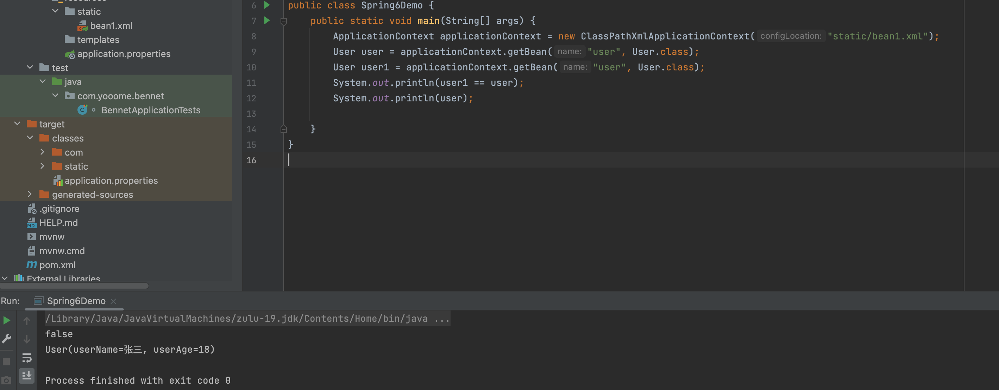

### 一、Spring框架概述

1.1 Spring 是轻量级的开源的 JavaEE 框架。

1.2 Spring 可以解决企业应用开发的复杂。

1.3 Spring 有两个核心部分：IOC 和 AOP。

- IOC：控制反转，把创建对象过程交给Spring进行管理。
- AOP：面向切面，不修改源代码进行功能增强。

1.4 Spring 特点：

- 方便解耦，简化开发。
- AOP编程支持。
- 方便程序测试。
- 方便和其他框架进行整合。
- 方便进行事务操作。
- 降低API开发难度。

### 二、IOC容器

#### 2.1 IOC概念和原理

##### 2.1.1 概念：

- 控制反转，把创建对象和对象的调用过程交给spring进行管理。
- 目的：降低耦合度。
- 底层原理：xml，反射，工厂模式。
- Spring提供IOC容器两种实现方式（两个接口）
  - **BeanFactory**：Spring内部使用的接口，不提倡开发人员使用。特点：加载配置文件时不会创建对象，获取对象时才会创建对象。
  - **ApplicationContext**：BeanFactory的子接口，提供了更多更强大的功能，一般由开发人员使用。特点：加载配置文件时会把配置文件里面的对象进行创建。
  - ApplicationContext两个常用实现类：
    - FileSystemXmlApplication：绝对路径，从盘符开始算起。
    - ClassPathXmlAppliation：相对路径，从src开始算起。


什么是Bean管理？Bean管理是指两个操作：Spring创建对象和Spring注入属性。

Bean管理有两种操作方式：基于xml配置文件方式实现和基于注解方式实现。

##### 2.1.2 IOC操作Bean管理（基于xml）

**xml实现Bean管理**

1. 基于xml方式创建对象：

> //配置User对象
>
> <bean id="user" class="com.yooome.spring6.User"></bean>

- 在Spring配置文件中使用bean标签来创建对象。
- bean标签有很多属性，常用属性：
  - id：唯一标识
  - class：类路径

- 创建对象时，默认执行无参构造函数

2. 基于xml方式注入属性：

**第一种方法**：使用set方法进行注入：

首先为类的属性提供set方法：

```java
public class User {

    private String userName;
    private String userAge;

    public void setUserName(String userName) {
        this.userName = userName;
    }

    public void setUserAge(String userAge) {
        this.userAge = userAge;
    }

    public String getUserName() {
        return userName;
    }

    public String getUserAge() {
        return userAge;
    }
}


```

然后再xml配置文件中通过property标签进行属性注入

```xml
    <!--配置User对象-->
    <bean id="user" class="com.yooome.spring6.User">
        <property name="userName" value="haha"></property>
        <property name="userAge" value="18"></property>
    </bean>
```

这样就完了

```java
ApplicationContext applicationContext = new ClassPathXmlApplicationContext("bean1.xml");
applicationContext.getBean("user",User.class);
System.out.println(user.getUserName() + " " + user.getUserAge());
```

**第二种方法**：使用有参数构造函数进行注入

首先提供有参构造方法：

```java
public class User {

    private String userName;
    private String userAge;

    public User(String userName, String userAge){
        this.userName = userName;
        this.userAge = userAge;
    }
}

```

然后再xml配置文件中通过construct-arg标签进行属性注入

```xml
    <!--配置User对象-->
    <bean id="user" class="com.yooome.spring6.User">
        <property name="userName" value="haha"></property>
        <property name="userAge" value="18"></property>
    </bean>
```

**第三种方法**：p名称空间注入（了解即可）

首先在xml配置文件中添加p名称空间，并且在bean标签中进行操作


然后提供set方法

```java
public class User {

    private String userName;
    private String userAge;

    public User() {
    }

    public void setUserName(String userName) {
        this.userName = userName;
    }

    public void setUserAge(String userAge) {
        this.userAge = userAge;
    }
}

```

3. xml注入其他属性

- null 值

```xml
    <!--配置User对象-->
    <bean id="user" class="com.yooome.spring6.User">
        <property name="userName"> <null/> </property>
    </bean>
```

- 属性值包含特殊符号

假设现在userName属性需要赋值为<haha>

如果像上面那样直接在value中声明的话会报错，因为包含特殊符号 <>


需要通过<![CDATA[值]]>


- 注入属性-外部bean

有两个类：UserService 和 UserDaoImpl ,其中 UserDaoImpl 实现UserDao接口

```java
public class UserService{
  private UserDao userDao;
  public void setUserDao(UserDao userDao){
    this.userDao = userDao;
  }
  
  public void add() {
    System.out.println("add");
  }
}
```

通过ref来制定创建userDaoImpl

```xml
<bean id="userDaoImpl" class="com.yooome.spring6.UserDaoImpl"></bean>

<bean id="userService" class="com.yooome.spring6.UserService">
    <property name="userDao" ref="userDaoImpl"></property>
</bean>

```

- 注入属性-内部bean

不通过ref属性，而是通过嵌套一个bean标签实现

```xml
<!--内部 bean-->
<bean id="emp" class="com.atguigu.spring5.bean.Emp">
     <!--设置两个普通属性-->
     <property name="ename" value="lucy"></property>
     <property name="gender" value="女"></property>
     <!--设置对象类型属性-->
     <property name="dept">
         <bean id="dept" class="com.yooome.spring6.bean.Dept">
        	 <property name="dname" value="安保部"></property>
         </bean>
     </property>
</bean>
```

- 注入属性-级联赋值

写法一：也就是上面所说的外部bean，通过ref属性来获取外部bean。

写法二：

emp 类中有 ename 和 dept 两个属性，其中 dept 有 dname 属性，写法二需要 emp 提供 dept 属性的 get 方法。

```xml
<!--级联赋值-->
<bean id="emp" class="com.yooome.spring6.bean.Emp">
    <!--设置两个普通属性-->
    <property name="ename" value="lucy"></property> <property name="gender" value="女"></property>
    <!--写法一-->
	<property name="dept" ref="dept"></property>
    <!--写法二-->
    <property name="dept.dname" value="技术部"></property>
</bean>
<bean id="dept" class="com.yooome.spring6.bean.Dept">
    <property name="dname" value="财务部"></property>
</bean>

```

6. 注入集合属性（数组，List，Map）

假设有一个Stu类

```java
public class Stu {

    private String[] courses;
    private List<String> list;
    private Map<String,String> map;
    private Set<String> set;

    public void setCourses(String[] courses) {
        this.courses = courses;
    }

    public void setList(List<String> list) {
        this.list = list;
    }

    public void setMap(Map<String, String> map) {
        this.map = map;
    }

    public void setSet(Set<String> set) {
        this.set = set;
    }
}

```

在xml配置文件中对这些集合属性进行注入

```xml
<bean id="stu" class="com.yooome.spring6.Stu">
    <!--数组类型属性注入-->
    <property name="courses">
        <array>
            <value>java课程</value>
            <value>数据库课程</value>
        </array>
    </property>
    <!--List类型属性注入-->
    <property name="list">
        <list>
            <value>张三</value>
            <value>李四</value>
        </list>
    </property>
    <!--Map类型属性注入-->
    <property name="map">
        <map>
            <entry key="JAVA" value="java"></entry>
            <entry key="PHP" value="php"></entry>
        </map>
    </property>
    <!--Set类型属性注入-->
    <property name="set">
        <set>
            <value>Mysql</value>
            <value>Redis</value>
        </set>
    </property>
</bean>

```

- 上面的集合值都是字符串，如果是对象的话，如下：

写法：集合 + 外部 bean

```xml
<!--创建多个 course 对象-->
<bean id="course1" class="com.yooome.spring6.collectiontype.Course">
	<property name="cname" value="Spring6 框架"></property>
</bean>
<bean id="course2" class="com.yooome.spring6.collectiontype.Course">
	<property name="cname" value="MyBatis 框架"></property>
</bean>

<!--注入 list 集合类型，值是对象-->
<property name="courseList">
    <list>
        <ref bean="course1"></ref>
        <ref bean="course2"></ref>
    </list>
</property>

```

- 把集合注入部分提取出来

使用util标签，这样不同的bean都可以使用相同的集合注入部分了。

```xml
<util:list id="booklist">
	<value>已经加</value>
  <value>九阳神功</value>
</util:list>
<bean id="book" class="com.yooome.spring6.Book">
	<property name="list" ref="booklist"></property>
</bean>
```

- FactoryBean

Spring有两种Bean，一种普通的Bean，另一种是工厂Bean（FactoryBean）

这块看不太懂，不知道有啥用，先放着。

#### 2.2 Bean的作用域

##### 2.2.1 在Spring中，默认情况下bean是单实例对象。


##### 2.2.2 通过bean标签的scope属性来设置但实力还是多实例。

###### 2.2.2.1 Scope属性值：

- **singleton**：默认值，表示但实例对象。加载配置文件时就会创建单实例对象。
- **property**：表示多实例对象。不是加载配置文件时创建对象，在调用getBean方法时创建多实例对象。


执行结果不同：



#### 2.3 Bean的生命周期

##### 2.3.1 bean的生命周期

1. 通过构造器创建 bean 实例(无参构造)
2. 为 bean 的属性设置和对其他 bean 引用（调用set方法）
3. 把 bean 实例传递 bean 后置处理器的方法 **postProcessBeforeInitialization**（初始化前的后置处理器）
4. 调用 bean 的初始化的方法（需要进行配置初始化的方法）
5. 把 bean 实例传递 bean 后置处理器的方法 **postProcessAfterInitialization** （初始化后的后置处理器）
6. bean 可以使用了（对象获取到了）
7. 当容器关闭时候，调用 bean 的销毁的方法（需要进行配置销毁的方法）

##### 2.3.2 演示bean的生命周期

```java
public class Orders {
    private String orderName;

    public Orders() {
        System.out.println("第一步：执行无参构造方法创建bean实例");
    }

    public void setOrderName(String orderName) {
        this.orderName = orderName;
        System.out.println("第二步：调用set方法设置属性值");
    }

    //初始化方法
    public void initMethod(){
        System.out.println("第四步：执行初始化方法");
    }

    //销毁方法
    public void destroyMethod(){
        System.out.println("第七步：执行销毁方法");
    }
}

```

```java
//实现后置处理器，需要实现BeanPostProcessor接口
public class MyBeanPost implements BeanPostProcessor {

    @Override
    public Object postProcessBeforeInitialization(Object bean, String beanName) throws BeansException {
        System.out.println("第三步：将bean实例传递给bean后置处理器的postProcessBeforeInitialization方法");
        return bean;
    }

    @Override
    public Object postProcessAfterInitialization(Object bean, String beanName) throws BeansException {
        System.out.println("第五步：将bean实例传递给bean后置处理器的postProcessAfterInitialization方法");
        return bean;
    }
}

```

```xml
<bean id="orders" class="com.oymn.spring5.Orders" init-method="initMethod" destroy-method="destroyMethod">
    <property name="orderName" value="hahah"></property>
</bean>

<!--配置bean后置处理器，这样配置后整个xml里面的bean用的都是这个后置处理器-->
<bean id="myBeanPost" class="com.yooome.spring6.MyBeanPost"></bean>

```

```java
@Test
public void testOrders(){

    ClassPathXmlApplicationContext context = new ClassPathXmlApplicationContext("bean1.xml");

    Orders orders = context.getBean("orders", Orders.class);

    System.out.println("第六步：获取bean实例对象");
    System.out.println(orders);

    //手动让bean实例销毁
    context.close();
}

```


##### 2.3.3 xml自动装配

- 根据指定的配置规则（属性名称或者属性类型），Spring自动将匹配的属性进行注入。
- 根据属性名称自动装配：要求 emp 中属性的名称 dept 和 bean 标签的id值dept一样，才能识别。

```xml
<bean id="emp" class="com.yooome.spring6.Emp" autowire="byName"></bean>
<bean id="dept" class="com.yooome.spring6.Dept"></bean>
```

##### 2.3.4 通过外部属性文件来操作bean：

例如配置数据库信息：

1. 导入德鲁伊连接池jar包。
2. 创建外部属性文件，properties格式文件，写数据库信息。


3. 引入context名称空间，并通过context标签引入外部属性文件，使用 ”${}“ 来获取文件中对应的值


#### 2.4 IOC操作Bean管理（基于注解）

- 格式：@注解名称（属性名=属性值，属性名=属性值，......)
- 注解可以作用在类，属性，方法。
- 使用注解的目的：简化xml配置。

##### 2.4.1 基于注解创建对象

spring提供了四种创建对象的注解：

- @Component：一般用于配置文件
- @Service：一般用于Service层

- @Controller： 一般用于web层
- @Respository：一般用于Dao层

流程：

1. 引入依赖。
2. 开启组件扫描：扫描base-package包下所有有注解的类并为其创建对象。

```xml
<context:component-scan base-package="com.yooome"></context:component-scan>
```

3. com.yooome.spring6.Service有一个stuService类。

```java
//这里通过@Component注解来创建对象,括号中value的值等同于之前xml创建对象使用的id,为了后面使用时通过id来获取对象
//括号中的内容也可以省略,默认是类名并且首字母小写
//可以用其他三个注解
@Component(value="stuService")
public class StuService {
    public void add(){
        System.out.println("addService");
    }
}
```

4. 这样就可以通过getBean方法来获取stuService对象了

```java
ClassPathXmlApplicationContext context = new ClassPathXmlApplicationContext("bean4.xml");
StuService stuService = context.getBean("stuService", StuService.class);
System.out.println(stuService);
stuService.add();
```

2.4.2 开启组件扫描


