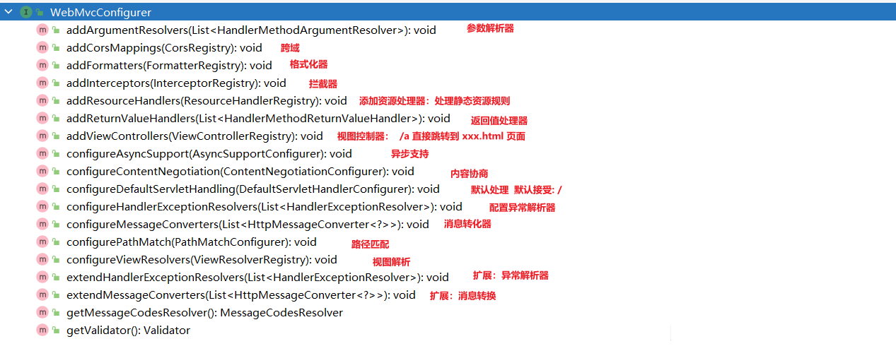
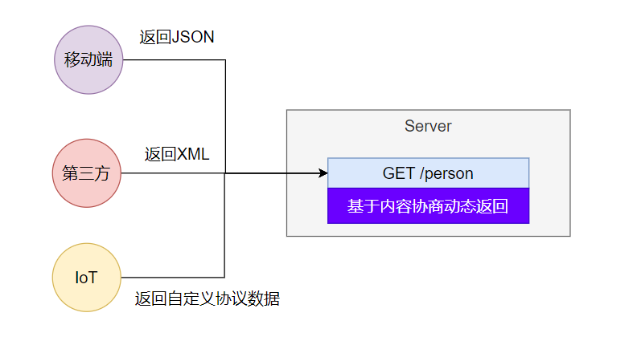
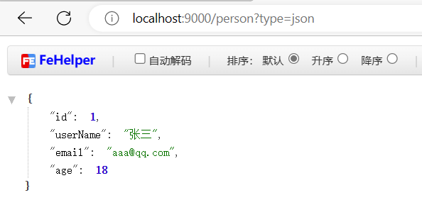
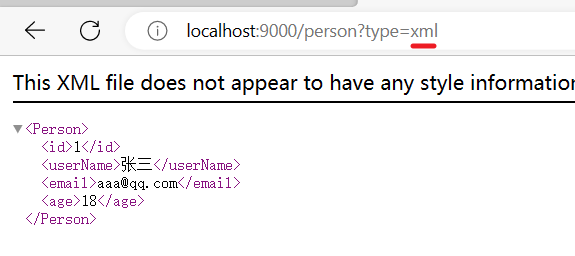

## SpringBoot3-Web开发

### 一、WebMvcAutoConfiguration原理

> SpringBoot的Web开发能力，由**SpringMVC**提供。

#### 1.1 生成条件

```java
@AutoConfiguration(after = { DispatcherServletAutoConfiguration.class, TaskExecutionAutoConfiguration.class,
		ValidationAutoConfiguration.class }) //在这些自动配置之后
@ConditionalOnWebApplication(type = Type.SERVLET) //如果是web应用就生效，类型SERVLET、REACTIVE 响应式web
@ConditionalOnClass({ Servlet.class, DispatcherServlet.class, WebMvcConfigurer.class })
@ConditionalOnMissingBean(WebMvcConfigurationSupport.class) //容器中没有这个Bean，才生效。默认就是没有
@AutoConfigureOrder(Ordered.HIGHEST_PRECEDENCE + 10)//优先级
@ImportRuntimeHints(WebResourcesRuntimeHints.class)
public class WebMvcAutoConfiguration { 
}
```

#### 1.2 效果

1. 放了两个Filter：

1. 1.  `HiddenHttpMethodFilter`；页面表单提交Rest请求（GET、POST、PUT、DELETE）
   2. `FormContentFilter`： 表单内容Filter，GET（数据放URL后面）、POST（数据放请求体）请求可以携带数据，PUT、DELETE 的请求体数据会被忽略

1. 给容器中放了`WebMvcConfigurer`组件；给SpringMVC添加各种定制功能

1. 1. 所有的功能最终会和配置文件进行绑定
   2. WebMvcProperties： `spring.mvc`配置文件
   3. WebProperties： `spring.web`配置文件

```java
	@Configuration(proxyBeanMethods = false)
	@Import(EnableWebMvcConfiguration.class) //额外导入了其他配置
	@EnableConfigurationProperties({ WebMvcProperties.class, WebProperties.class })
	@Order(0)
	public static class WebMvcAutoConfigurationAdapter implements WebMvcConfigurer, ServletContextAware{
        
    }
```

#### 1.3 WebMvcConfigurer接口

提供了配置SpringMVC底层的所有组件入口




#### 1.4 静态资源规则源码

```java
@Override
public void addResourceHandlers(ResourceHandlerRegistry registry) {
    if (!this.resourceProperties.isAddMappings()) {
        logger.debug("Default resource handling disabled");
        return;
    }
    //1、
    addResourceHandler(registry, this.mvcProperties.getWebjarsPathPattern(),
            "classpath:/META-INF/resources/webjars/");
    addResourceHandler(registry, this.mvcProperties.getStaticPathPattern(), (registration) -> {
        registration.addResourceLocations(this.resourceProperties.getStaticLocations());
        if (this.servletContext != null) {
            ServletContextResource resource = new ServletContextResource(this.servletContext, SERVLET_LOCATION);
            registration.addResourceLocations(resource);
        }
    });
}
```

1. 规则一：访问： `/webjars/**`路径就去 `classpath:/META-INF/resources/webjars/`下找资源.

1. 1. maven 导入依赖
   2. 

2. 规则二：访问： `/**`路径就去 `静态资源默认的四个位置找资源`

1. 1. `classpath:/META-INF/resources/`
   2. `classpath:/resources/`
   3. `classpath:/static/`
   4. `classpath:/public/`

3. 规则三：**静态资源默认都有缓存规则的设置**

1. 1. 所有缓存的设置，直接通过**配置文件**： `spring.web`
   2. cachePeriod： 缓存周期； 多久不用找服务器要新的。 默认没有，以s为单位
   3. cacheControl： **HTTP缓存**控制；[https://developer.mozilla.org/zh-CN/docs/Web/HTTP/Caching](https://developer.mozilla.org/zh-CN/docs/Web/HTTP/Caching#概览)
   4. **useLastModified**：是否使用最后一次修改。配合HTTP Cache规则

> 如果浏览器访问了一个静态资源 `index.js`，如果服务这个资源没有发生变化，下次访问的时候就可以直接让浏览器用自己缓存中的东西，而不用给服务器发请求。

```java
registration.setCachePeriod(getSeconds(this.resourceProperties.getCache().getPeriod()));
registration.setCacheControl(this.resourceProperties.getCache().getCachecontrol().toHttpCacheControl());
registration.setUseLastModified(this.resourceProperties.getCache().isUseLastModified());
```

#### 1.5 EnableWebMvcConfiguration 源码

```java
//SpringBoot 给容器中放 WebMvcConfigurationSupport 组件。
//我们如果自己放了 WebMvcConfigurationSupport 组件，Boot的WebMvcAutoConfiguration都会失效。
@Configuration(proxyBeanMethods = false)
@EnableConfigurationProperties(WebProperties.class)
public static class EnableWebMvcConfiguration extends DelegatingWebMvcConfiguration implements ResourceLoaderAware 
{

    
}
```

1. `HandlerMapping`： 根据请求路径 ` /a` 找那个handler能处理请求

1. 1. `WelcomePageHandlerMapping`： 

1. 1. 1. 访问 `/**`路径下的所有请求，都在以前四个静态资源路径下找，欢迎页也一样
      2. 找`index.html`：只要静态资源的位置有一个 `index.html`页面，项目启动默认访问

#### 1.6 为什么容器中放一个`WebMvcConfigurer`就能配置底层行为

1. WebMvcAutoConfiguration 是一个自动配置类，它里面有一个 `EnableWebMvcConfiguration`
2. `EnableWebMvcConfiguration`继承与 `DelegatingWebMvcConfiguration`，这两个都生效
3. `DelegatingWebMvcConfiguration`利用 DI 把容器中 所有 `WebMvcConfigurer `注入进来
4. 别人调用 ``DelegatingWebMvcConfiguration`` 的方法配置底层规则，而它调用所有 `WebMvcConfigurer`的配置底层方法。

#### 1.7 WebMvcConfigurationSupport

提供了很多的默认设置。

判断系统中是否有相应的类：如果有，就加入相应的`HttpMessageConverter`

```java
jackson2Present = ClassUtils.isPresent("com.fasterxml.jackson.databind.ObjectMapper", classLoader) &&
				ClassUtils.isPresent("com.fasterxml.jackson.core.JsonGenerator", classLoader);
jackson2XmlPresent = ClassUtils.isPresent("com.fasterxml.jackson.dataformat.xml.XmlMapper", classLoader);
jackson2SmilePresent = ClassUtils.isPresent("com.fasterxml.jackson.dataformat.smile.SmileFactory", classLoader);
```

### 二、Web场景

#### 2.1 自动配置

1、整合web场景

```xml
<dependency>
  <groupId>org.springframework.boot</groupId>
  <artifactId>spring-boot-starter-web</artifactId>
</dependency>
```

2、引入了 `autoconfigure`功能

3、`@EnableAutoConfiguration`注解使用`@Import(AutoConfigurationImportSelector.class)`批量导入组件

4、加载 `META-INF/spring/org.springframework.boot.autoconfigure.AutoConfiguration.imports` 文件中配置的所有组件

5、所有自动配置类如下

```tex
org.springframework.boot.autoconfigure.web.client.RestTemplateAutoConfiguration
org.springframework.boot.autoconfigure.web.embedded.EmbeddedWebServerFactoryCustomizerAutoConfiguration
====以下是响应式web场景和现在的没关系======
org.springframework.boot.autoconfigure.web.reactive.HttpHandlerAutoConfiguration
org.springframework.boot.autoconfigure.web.reactive.ReactiveMultipartAutoConfiguration
org.springframework.boot.autoconfigure.web.reactive.ReactiveWebServerFactoryAutoConfiguration
org.springframework.boot.autoconfigure.web.reactive.WebFluxAutoConfiguration
org.springframework.boot.autoconfigure.web.reactive.WebSessionIdResolverAutoConfiguration
org.springframework.boot.autoconfigure.web.reactive.error.ErrorWebFluxAutoConfiguration
org.springframework.boot.autoconfigure.web.reactive.function.client.ClientHttpConnectorAutoConfiguration
org.springframework.boot.autoconfigure.web.reactive.function.client.WebClientAutoConfiguration
================以上没关系=================
org.springframework.boot.autoconfigure.web.servlet.DispatcherServletAutoConfiguration
org.springframework.boot.autoconfigure.web.servlet.ServletWebServerFactoryAutoConfiguration
org.springframework.boot.autoconfigure.web.servlet.error.ErrorMvcAutoConfiguration
org.springframework.boot.autoconfigure.web.servlet.HttpEncodingAutoConfiguration
org.springframework.boot.autoconfigure.web.servlet.MultipartAutoConfiguration
org.springframework.boot.autoconfigure.web.servlet.WebMvcAutoConfiguration
```

6、绑定了配置文件的一堆配置项

- 1、SpringMVC的所有配置 `spring.mvc`
- 2、Web场景通用配置 `spring.web`
- 3、文件上传配置 `spring.servlet.multipart`
- 4、服务器的配置 `server`: 比如：编码方式

#### 2.2 默认效果

默认配置：

1. 包含了 ContentNegotiatingViewResolver 和 BeanNameViewResolver 组件，**方便视图解析**
2. **默认的静态资源处理机制**： 静态资源放在 static 文件夹下即可直接访问
3. **自动注册**了 **Converter**,GenericConverter,**Formatter**组件，适配常见**数据类型转换**和**格式化需求**
4. **支持** **HttpMessageConverters**，可以**方便返回**json等**数据类型**
5. **注册** MessageCodesResolver，方便**国际化**及错误消息处理
6. **支持 静态** index.html
7. **自动使用**ConfigurableWebBindingInitializer，实现消息处理、数据绑定、类型转化、数据校验等功能

> **重要：**
>
> - 如果想保持 boot mvc 的默认配置，并且自定义更多的 mvc 配置，如：***interceptors***，***formatters***，***view controllers***等。可以使用 `@Configuration` 注解添加一个 ***WebMvcConfigurer*** 类型的配置类，并不要标注`@EnableWebMvc`
> - 如果想保持boot mvc 的默认配置，但要自定义核心组件实例，比如：***RequestMappingHandlerMapping*** ，***RequestMappingHandlerAdapter***，或 ***ExceptionHandlerExceptionResolver*** ,给容器中放一个 ***WebMvcRegistrations*** 组件即可。
> - 如果想要全面接管 Spring MVC，`@Configuration` 标注一个配置类，并加上 `@EnableWebMvc` 注解


### 三、静态资源

#### 3.1 默认规则

##### 3.1.1 静态资源映射

静态资源映射规则在 WebMvcAutoConfiguration 中进行了定义：

1. /webjars/** 的所有路径 资源都在 classpath:/META-INF/resources/webjars/
2. /** 的所有路径 资源都在 classpath:/META-INF/resources/、classpath:/resources/、classpath:/static/、classpath:/public/
3. 所有静态资源都定义了缓存规则。【浏览器访问过一次，就会缓存一段时间】，但此功能参数无默认值

1. 1. period： 缓存间隔。 默认 0S；
   2. cacheControl：缓存控制。 默认无；
   3. useLastModified：是否使用lastModified头。 默认 false；

##### 3.1.2 静态资源缓存

如前面所述

1. 所有静态资源都定义了缓存规则。【浏览器访问过一次，就会缓存一段时间】，但此功能参数无默认值

1. 1. period： 缓存间隔。 默认 0S；
   2. cacheControl：缓存控制。 默认无；
   3. useLastModified：是否使用lastModified头。 默认 false；

##### 3.1.3 欢迎页

欢迎页规则在 WebMvcAutoConfiguration 中进行了定义：

1. 在**静态资源**目录下找 index.html
2. 没有就在 templates下找index模板页

##### 3.1.4 Favicon

1. 在静态资源目录下找 favicon.ico

##### 3.1.5 缓存实验

```Properties
server.port=9000

#1、spring.web：
# 1.配置国际化的区域信息
# 2.静态资源策略(开启、处理链、缓存)

#开启静态资源映射规则
spring.web.resources.add-mappings=true

#设置缓存
#spring.web.resources.cache.period=3600
##缓存详细合并项控制，覆盖period配置：
## 浏览器第一次请求服务器，服务器告诉浏览器此资源缓存7200秒，7200秒以内的所有此资源访问不用发给服务器请求，7200秒以后发请求给服务器
spring.web.resources.cache.cachecontrol.max-age=7200
#使用资源 last-modified 时间，来对比服务器和浏览器的资源是否相同没有变化。相同返回 304
spring.web.resources.cache.use-last-modified=true
```

#### 3.2 自定义静态资源规则

> 自定义静态资源路径、自定义缓存规则

##### 3.2.1 配置方式

`spring.mvc`： 静态资源访问前缀路径

`spring.web`：

- 静态资源目录
- 静态资源缓存策略

```properties
#1、spring.web：
# 1.配置国际化的区域信息
# 2.静态资源策略(开启、处理链、缓存)

#开启静态资源映射规则
spring.web.resources.add-mappings=true

#设置缓存
spring.web.resources.cache.period=3600
##缓存详细合并项控制，覆盖period配置：
## 浏览器第一次请求服务器，服务器告诉浏览器此资源缓存7200秒，7200秒以内的所有此资源访问不用发给服务器请求，7200秒以后发请求给服务器
spring.web.resources.cache.cachecontrol.max-age=7200
## 共享缓存
spring.web.resources.cache.cachecontrol.cache-public=true
#使用资源 last-modified 时间，来对比服务器和浏览器的资源是否相同没有变化。相同返回 304
spring.web.resources.cache.use-last-modified=true

#自定义静态资源文件夹位置
spring.web.resources.static-locations=classpath:/a/,classpath:/b/,classpath:/static/

#2、 spring.mvc
## 2.1. 自定义webjars路径前缀
spring.mvc.webjars-path-pattern=/wj/**
## 2.2. 静态资源访问路径前缀
spring.mvc.static-path-pattern=/static/**
```

##### 3.1.2 代码方式

> - 容器中只要有一个 WebMvcConfigurer 组件。配置的底层行为都会生效
> - @EnableWebMvc //禁用boot的默认配置

```java
@Configuration //这是一个配置类
public class MyConfig implements WebMvcConfigurer {


    @Override
    public void addResourceHandlers(ResourceHandlerRegistry registry) {
        //保留以前规则
        //自己写新的规则。
        registry.addResourceHandler("/static/**")
                .addResourceLocations("classpath:/a/","classpath:/b/")
                .setCacheControl(CacheControl.maxAge(1180, TimeUnit.SECONDS));
    }
}
```

```java
@Configuration //这是一个配置类,给容器中放一个 WebMvcConfigurer 组件，就能自定义底层
public class MyConfig  /*implements WebMvcConfigurer*/ {


    @Bean
    public WebMvcConfigurer webMvcConfigurer(){
        return new WebMvcConfigurer() {
            @Override
            public void addResourceHandlers(ResourceHandlerRegistry registry) {
                registry.addResourceHandler("/static/**")
                        .addResourceLocations("classpath:/a/", "classpath:/b/")
                        .setCacheControl(CacheControl.maxAge(1180, TimeUnit.SECONDS));
            }
        };
    }

}
```

### 四、路径匹配

> **Spring5.3** 之后加入了更多的请求路径匹配的实现策略；
>
> 以前只支持 AntPathMatcher 策略, 现在提供了 **PathPatternParser** 策略。并且可以让我们指定到底使用那种策略。

#### 4.1 Ant风格路径用法

Ant 风格的路径模式语法具有以下规则：

- *：表示**任意数量**的字符。
- ?：表示任意**一个字符**。
- **：表示**任意数量的目录**。
- {}：表示一个命名的模式**占位符**。
- []：表示**字符集合**，例如[a-z]表示小写字母。

例如：

- *.html 匹配任意名称，扩展名为.html的文件。
- /folder1/*/*.java 匹配在folder1目录下的任意两级目录下的.java文件。
- /folder2/**/*.jsp 匹配在folder2目录下任意目录深度的.jsp文件。
- /{type}/{id}.html 匹配任意文件名为{id}.html，在任意命名的{type}目录下的文件。

注意：Ant 风格的路径模式语法中的特殊字符需要转义，如：

- 要匹配文件路径中的星号，则需要转义为\\*。
- 要匹配文件路径中的问号，则需要转义为\\?。


#### 4.2 模式切换

#### AntPathMatcher 与 `PathPatternParser`

- PathPatternParser 在 jmh 基准测试下，有 6~8 倍吞吐量提升，降低 30%~40%空间分配率
- PathPatternParser 兼容 AntPathMatcher语法，并支持更多类型的路径模式
- PathPatternParser  "***\***" **多段匹配**的支持**仅允许在模式末尾使用**

```java
    @GetMapping("/a*/b?/{p1:[a-f]+}")
    public String hello(HttpServletRequest request, 
                        @PathVariable("p1") String path) {

        log.info("路径变量p1： {}", path);
        //获取请求路径
        String uri = request.getRequestURI();
        return uri;
    }
```

总结： 

- 使用默认的路径匹配规则，是由 PathPatternParser  提供的
- 如果路径中间需要有 **，替换成ant风格路径

```properties
# 改变路径匹配策略：
# ant_path_matcher 老版策略；
# path_pattern_parser 新版策略；
spring.mvc.pathmatch.matching-strategy=ant_path_matcher
```

### 五、内容协商

> 一套系统适配多段数据返回



#### 5.1  多端内容适配

##### 5.1.1 默认规则

1. **SpringBoot 多端内容适配**。

1. 1. **基于** **请求头** **内容协商**：（默认开启）

1. 1. 1. 客户端向服务端发送请求，携带HTTP标准的**Accept请求头**。

1. 1. 1. 1. **Accept**: `application/json`、`text/xml`、`text/yaml`
         2. 服务端根据客户端**请求头期望的数据类型**进行**动态返回**

1. 1. **基于** **请求参数** **内容协商：（需要开启）**

1. 1. 1. 发送请求 GET /projects/spring-boot?format=json 
      2. 匹配到 @GetMapping("/projects/spring-boot") 
      3. 根据**参数协商**，优先返回 json 类型数据【**需要开启参数匹配设置**】
      4. 发送请求 GET /projects/spring-boot?format=xml,优先返回 xml 类型数据


##### 5.1.2 效果演示

请求同一个接口，可以返回json和xml不同格式数据

1. 引入支持写出xml内容依赖

```xml
<dependency>
    <groupId>com.fasterxml.jackson.dataformat</groupId>
    <artifactId>jackson-dataformat-xml</artifactId>
</dependency>
```

2. 标注注解

```java
@JacksonXmlRootElement  // 可以写出为xml文档
@Data
public class Person {
    private Long id;
    private String userName;
    private String email;
    private Integer age;
}
```

3. 开启基于请求参数的内容协商

```properties
# 开启基于请求参数的内容协商功能。 默认参数名：format。 默认此功能不开启
spring.mvc.contentnegotiation.favor-parameter=true
# 指定内容协商时使用的参数名。默认是 format
spring.mvc.contentnegotiation.parameter-name=type
```

4. 效果





##### 5.1.3 配置写上规则与支持类型

1. 修改内容协商方式

```properties
#使用参数进行内容协商
spring.mvc.contentnegotiation.favor-parameter=true  
#自定义参数名，默认为format
spring.mvc.contentnegotiation.parameter-name=myparam 
```

2. 大多数 MediaType 都是开箱即用的。也可以**自定义内容类型，如：**

```properties
spring.mvc.contentnegotiation.media-types.yaml=text/yaml
```

#### 5.2 自定义内容返回

##### 5.2.1 增加yaml返回支持

导入依赖

```xml
<dependency>
    <groupId>com.fasterxml.jackson.dataformat</groupId>
    <artifactId>jackson-dataformat-yaml</artifactId>
</dependency>
```

把对象写出yaml

```java
    public static void main(String[] args) throws JsonProcessingException {
        Person person = new Person();
        person.setId(1L);
        person.setUserName("张三");
        person.setEmail("aaa@qq.com");
        person.setAge(18);

        YAMLFactory factory = new YAMLFactory().disable(YAMLGenerator.Feature.WRITE_DOC_START_MARKER);
        ObjectMapper mapper = new ObjectMapper(factory);

        String s = mapper.writeValueAsString(person);
        System.out.println(s);
    }
```

编写配置

```properties
#新增一种媒体类型
spring.mvc.contentnegotiation.media-types.yaml=text/yaml
```

增加`HttpMessageConverter`组件，专门负责把对象写出为yaml格式

```java
    @Bean
    public WebMvcConfigurer webMvcConfigurer(){
        return new WebMvcConfigurer() {
            @Override //配置一个能把对象转为yaml的messageConverter
            public void configureMessageConverters(List<HttpMessageConverter<?>> converters) {
                converters.add(new MyYamlHttpMessageConverter());
            }
        };
    }
```

##### 5.2.2 思考：如何增加其他

- 配置媒体类型支持: 

- - `spring.mvc.contentnegotiation.media-types.yaml=text/yaml`

- 编写对应的`HttpMessageConverter`，要告诉Boot这个支持的媒体类型

- - 按照3的示例

- 把MessageConverter组件加入到底层

- - 容器中放一个``WebMvcConfigurer`` 组件，并配置底层的`MessageConverter`

##### 5.2.3  HttpMessageConverter的示例写法

```java
public class MyYamlHttpMessageConverter extends AbstractHttpMessageConverter<Object> {

    private ObjectMapper objectMapper = null; //把对象转成yaml

    public MyYamlHttpMessageConverter(){
        //告诉SpringBoot这个MessageConverter支持哪种媒体类型  //媒体类型
        super(new MediaType("text", "yaml", Charset.forName("UTF-8")));
        YAMLFactory factory = new YAMLFactory()
                .disable(YAMLGenerator.Feature.WRITE_DOC_START_MARKER);
        this.objectMapper = new ObjectMapper(factory);
    }

    @Override
    protected boolean supports(Class<?> clazz) {
        //只要是对象类型，不是基本类型
        return true;
    }

    @Override  //@RequestBody
    protected Object readInternal(Class<?> clazz, HttpInputMessage inputMessage) throws IOException, HttpMessageNotReadableException {
        return null;
    }

    @Override //@ResponseBody 把对象怎么写出去
    protected void writeInternal(Object methodReturnValue, HttpOutputMessage outputMessage) throws IOException, HttpMessageNotWritableException {

        //try-with写法，自动关流
        try(OutputStream os = outputMessage.getBody()){
            this.objectMapper.writeValue(os,methodReturnValue);
        }

    }
}
```

#### 5.3 内容协商原理-`HttpMessageConverter`

> - `HttpMessageConverter` 怎么工作？合适工作？
> - 定制 `HttpMessageConverter`  来实现多端内容协商
> - 编写`WebMvcConfigurer`提供的`configureMessageConverters`底层，修改底层的`MessageConverter`

5.3.1 `@ResponseBody`由`HttpMessageConverter`处理

> 标注了`@ResponseBody`的返回值 将会由支持它的 `HttpMessageConverter`写给浏览器

1. 如果controller方法的返回值标注了 `@ResponseBody `注解

1. 1. 请求进来先来到`DispatcherServlet`的`doDispatch()`进行处理
   2. 找到一个 `HandlerAdapter `适配器。利用适配器执行目标方法
   3. `RequestMappingHandlerAdapter`来执行，调用`invokeHandlerMethod（）`来执行目标方法
   4. 目标方法执行之前，准备好两个东西

1. 1. 1. `HandlerMethodArgumentResolver`：参数解析器，确定目标方法每个参数值
      2. `HandlerMethodReturnValueHandler`：返回值处理器，确定目标方法的返回值改怎么处理

1. 5. `RequestMappingHandlerAdapter` 里面的`invokeAndHandle()`真正执行目标方法

2. 6. 目标方法执行完成，会返回**返回值对象**

3. 7. **找到一个合适的返回值处理器** `HandlerMethodReturnValueHandler`

4. 8. 最终找到 `RequestResponseBodyMethodProcessor`能处理 标注了 `@ResponseBody`注解的方法

5. 9. `RequestResponseBodyMethodProcessor` 调用`writeWithMessageConverters `,利用`MessageConverter`把返回值写出去

6. 

> 上面解释：`@ResponseBody`由`HttpMessageConverter`处理

2. `HttpMessageConverter` 会**先进行内容协商**

1. 1. 遍历所有的`MessageConverter`看谁支持这种**内容类型的数据**
   2. 默认`MessageConverter`有以下


1. 3. 最终因为要`json`所以`MappingJackson2HttpMessageConverter`支持写出json

2. 4. jackson用`ObjectMapper`把对象写出去


##### 5.3.2. `WebMvcAutoConfiguration`提供几种默认`HttpMessageConverters`

- `EnableWebMvcConfiguration`通过 `addDefaultHttpMessageConverters`添加了默认的`MessageConverter`；如下：

- - `ByteArrayHttpMessageConverter`： 支持字节数据读写
  - `StringHttpMessageConverter`： 支持字符串读写
  - `ResourceHttpMessageConverter`：支持资源读写
  - `ResourceRegionHttpMessageConverter`: 支持分区资源写出
  - `AllEncompassingFormHttpMessageConverter`：支持表单xml/json读写
  - `MappingJackson2HttpMessageConverter`： 支持请求响应体Json读写

默认8个：


> 系统提供默认的MessageConverter 功能有限，仅用于json或者普通返回数据。额外增加新的内容协商功能，必须增加新的`HttpMessageConverter`


